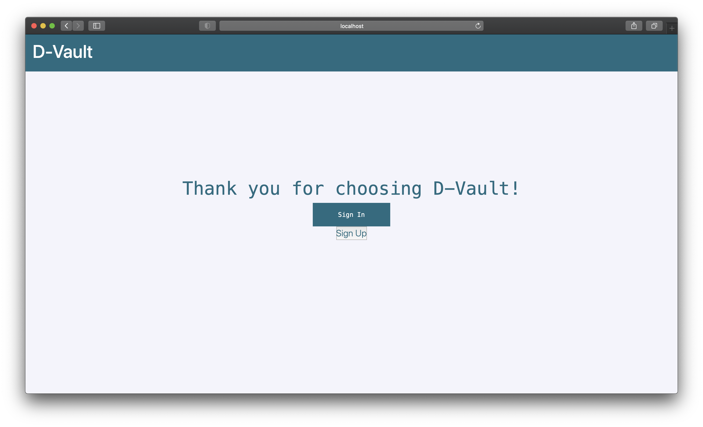
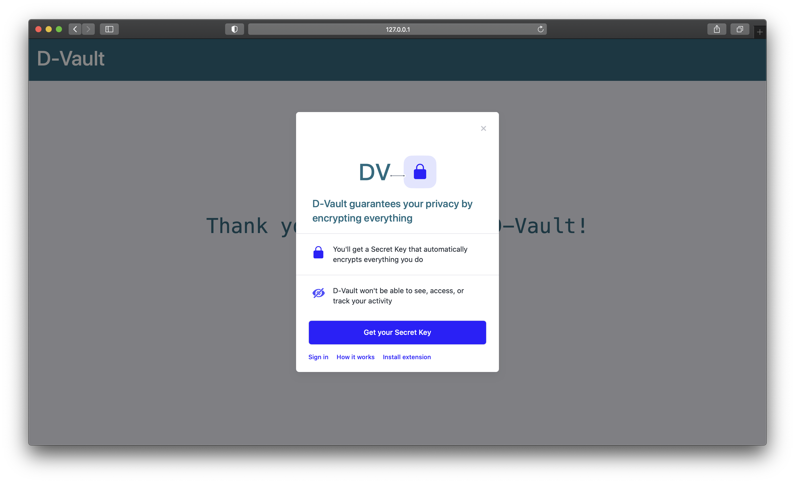
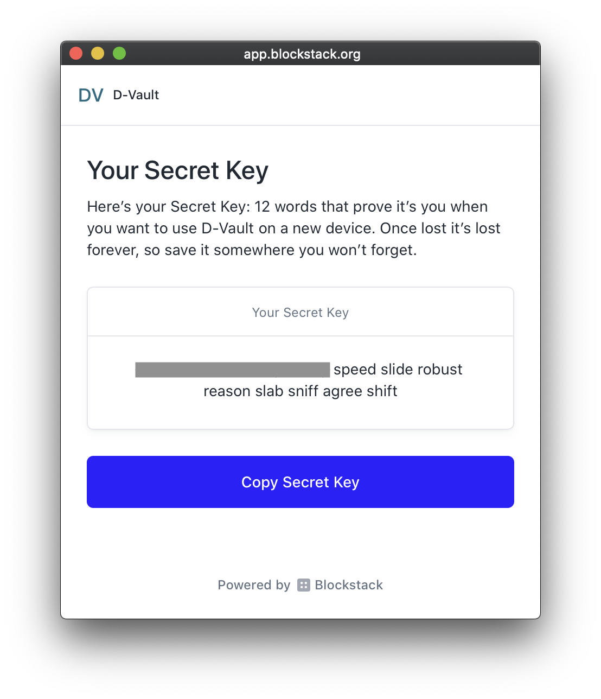
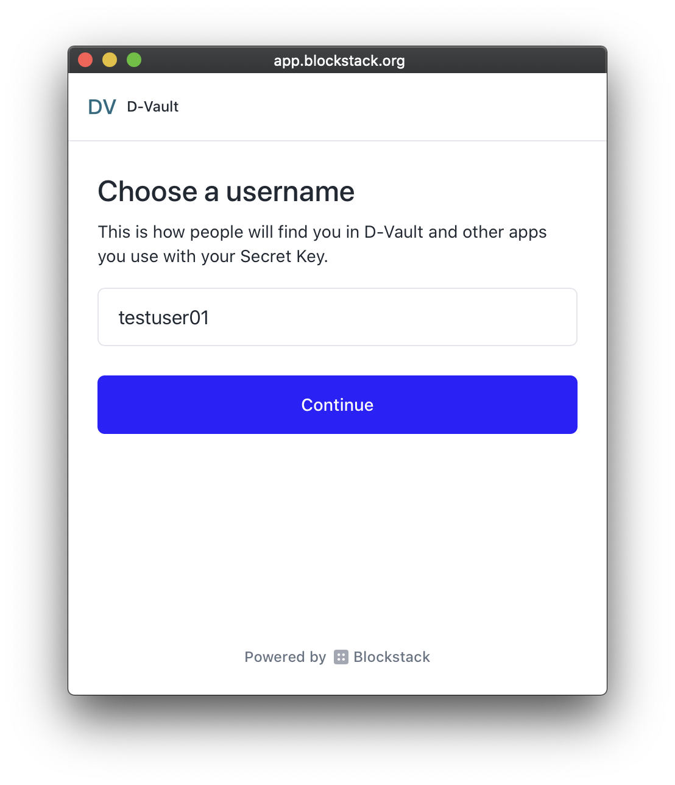
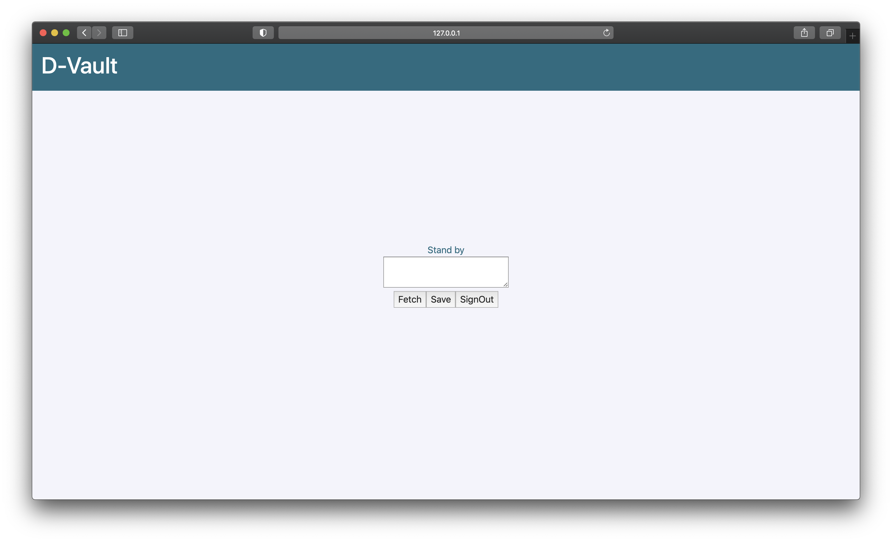
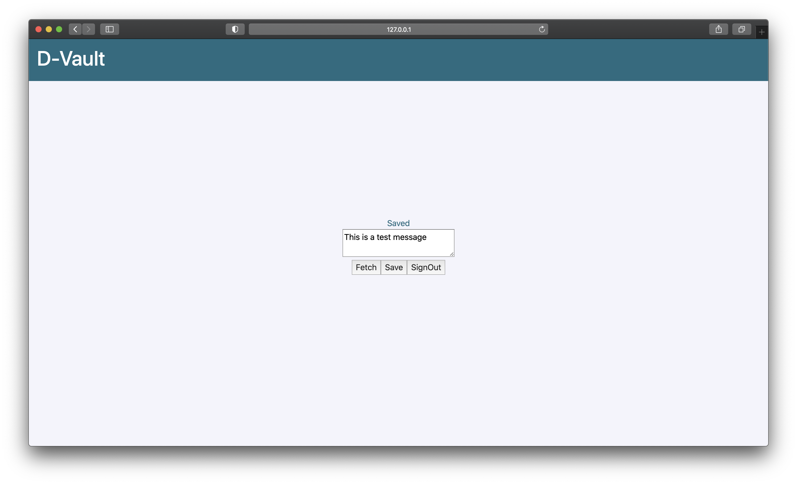

# D-Vault
## About
D-Vault is a decentralized personal information safekeeping application, built on top of the [Blockstack](https://www.blockstack.org/) technologies.

## Dependencies
App dependencies are described in the ./package.json file. To install dependencies, make sure you have Node.js and npm command line tool installed on your machine, change directory to project root directory, then execute:
```
npm install
```

## Execution
1. To build and run the testing version of the App:
```
npm start
```
2. To build the production version of the App:
```
npm run build
```

## App usage
App home page when App first launched:
<p align="center">
  
</p>

Click on "Sign in" button to initiate authentication process:
<p align="center">
  
</p>

Create a Blockstack account by click on the "Get your Secret Key" button. (To sign in with a existing Blockstack account, click on the "Sign in" button at lower left) You will be redirected to the Blockstack authentication portal, your Secret Key will be presented:
<p align="center">
  
</p>

Save your Secret Key at a safe place, then pick a username for your account:
<p align="center">
  
</p>

After you have signed in, the App will present you the data exchange page:
<p align="center">
  
</p>

To save the information to your Gaia storage, type your information in the text area then click on the "Save" button:
<p align="center">
  
</p>

To fetch the saved information, click on the "Fetch" button then the text area will be populated with the fetched info:
<p align="center">
  
</p>

## Credits
tdai06, kkha all rights reserved.  
App template generated by using: [blockstack-app-generator](https://github.com/blockstack/blockstack-app-generator)